# 🏗️ MedTechAI RCM - Architecture Diagrams (Mermaid)

This document contains comprehensive Mermaid diagrams for the entire backend agentic application.

---

## 📊 Table of Contents

1. [High-Level System Architecture](#1-high-level-system-architecture)
2. [Agent Workflow - Simple Pipeline](#2-agent-workflow---simple-pipeline)
3. [Agent Workflow - Enhanced Pipeline](#3-agent-workflow---enhanced-pipeline)
4. [LLM Integration Flow](#4-llm-integration-flow)
5. [RAG System Architecture](#5-rag-system-architecture)
6. [API Request Flow](#6-api-request-flow)
7. [Database Schema](#7-database-schema)
8. [Agent Class Hierarchy](#8-agent-class-hierarchy)
9. [Configuration Management](#9-configuration-management)
10. [Error Handling Flow](#10-error-handling-flow)

---

## 1. High-Level System Architecture


---

## 2. Agent Workflow - Simple Pipeline


---

## 3. Agent Workflow - Enhanced Pipeline

```mermaid
flowchart TD
    START([Client Request]) --> PARSE[Stage 1: Parse Documents<br/>ParserAgent]
    
    PARSE --> RAG_RETRIEVE[Stage 2: RAG Retrieval<br/>Query ChromaDB for guidelines]
    
    RAG_RETRIEVE --> PARALLEL{Execution Mode?}
    
    PARALLEL -->|Parallel| PAR_START[Parallel Execution]
    PARALLEL -->|Sequential| SEQ_START[Sequential Execution]
    
    %% Parallel branch
    PAR_START --> ICD_PAR[Stage 3a: Extract ICD<br/>NoteToICDAgent + RAG]
    PAR_START --> CPT_PREP[Wait for ICD...]
    
    ICD_PAR --> CPT_PAR[Stage 3b: Suggest CPT<br/>ICDToCPTAgent + Context]
    CPT_PREP --> CPT_PAR
    
    CPT_PAR --> VAL_PARALLEL[Stage 4: Parallel Validation]
    
    VAL_PARALLEL --> VAL1[Validation Check<br/>CodeValidationAgent]
    VAL_PARALLEL --> VAL2[Medical Necessity<br/>Direct LLM Call]
    VAL_PARALLEL --> VAL3[Compliance Check<br/>NCCI, LCD, Bundling]
    
    VAL1 --> GATHER_PAR[Gather Results]
    VAL2 --> GATHER_PAR
    VAL3 --> GATHER_PAR
    
    %% Sequential branch
    SEQ_START --> ICD_SEQ[Stage 3: Extract ICD<br/>NoteToICDAgent + RAG]
    ICD_SEQ --> CPT_SEQ[Stage 4: Suggest CPT<br/>ICDToCPTAgent + Context]
    CPT_SEQ --> VAL_SEQ1[Stage 5a: Validation<br/>CodeValidationAgent]
    VAL_SEQ1 --> VAL_SEQ2[Stage 5b: Medical Necessity]
    VAL_SEQ2 --> VAL_SEQ3[Stage 5c: Compliance Check]
    VAL_SEQ3 --> GATHER_SEQ[Results Ready]
    
    GATHER_PAR --> SUMMARY
    GATHER_SEQ --> SUMMARY
    
    SUMMARY[Stage 6: Executive Summary<br/>SummarizerAgent] --> DECISION{Decision Engine}
    
    DECISION -->|Confidence >= 0.85<br/>Denial Risk < 0.2| APPROVE[✅ Auto-Approve]
    DECISION -->|Denial Risk > 0.7| REJECT[❌ Reject - Critical Issues]
    DECISION -->|Otherwise| REVIEW[⚠️ Manual Review Required]
    
    APPROVE --> RESULT[Return Results]
    REJECT --> RESULT
    REVIEW --> RESULT
    
    RESULT --> END([Response to Client])
    
    %% Styling
    classDef parseStyle fill:#ffd93d,stroke:#f77f00,stroke-width:2px
    classDef ragStyle fill:#6a4c93,stroke:#1982c4,stroke-width:2px,color:#fff
    classDef agentStyle fill:#f72585,stroke:#b5179e,stroke-width:2px,color:#fff
    classDef decisionStyle fill:#06ffa5,stroke:#06d6a0,stroke-width:3px
    classDef approveStyle fill:#52b788,stroke:#1b4332,stroke-width:2px,color:#fff
    classDef rejectStyle fill:#ef476f,stroke:#c1121f,stroke-width:2px,color:#fff
    
    class PARSE parseStyle
    class RAG_RETRIEVE ragStyle
    class ICD_PAR,CPT_PAR,ICD_SEQ,CPT_SEQ,VAL1,VAL2,VAL3,SUMMARY agentStyle
    class DECISION decisionStyle
    class APPROVE approveStyle
    class REJECT,REVIEW rejectStyle
```



---

## 4. LLM Integration Flow


---

## 5. RAG System Architecture


---

## 6. API Request Flow


---

## 7. Database Schema


---

## 8. Agent Class Hierarchy


---

## 9. Configuration Management


---

## 10. Error Handling Flow


---

## 📝 How to Use These Diagrams

### Viewing in GitHub

GitHub automatically renders Mermaid diagrams in Markdown files. Just view this file on GitHub!

### Viewing Locally

1. **VS Code**: Install "Markdown Preview Mermaid Support" extension
2. **Online**: Copy diagram code to https://mermaid.live/
3. **CLI**: Use `mmdc` (mermaid-cli) to generate images

```bash
# Install mermaid-cli
npm install -g @mermaid-js/mermaid-cli

# Generate PNG
mmdc -i ARCHITECTURE_DIAGRAMS.md -o diagram.png
```

### Editing Diagrams

1. Visit https://mermaid.live/
2. Copy the diagram code
3. Edit and preview in real-time
4. Copy back to this file

---

## 🎨 Diagram Legend

| Color | Meaning |
|-------|---------|
| 🟣 Purple | API/Routing Layer |
| 🔴 Pink/Red | Agent Layer |
| 🔵 Blue | Service Layer |
| 🟢 Green | Data/Storage Layer |
| 🟡 Yellow | Processing/Parsing |
| 🟠 Orange | Configuration |

---

## 📚 Related Documentation

- **LLM Usage**: See `LLM_USAGE_SUMMARY.md`
- **Testing**: See `TESTING_GUIDE.md`
- **Use Case 1**: See `USECASE1_GUIDE.md`
- **Current Status**: See `CURRENT_STATUS.md`
- **API Configuration**: See `HOW_TO_CONFIGURE_API_KEY.md`

---

**Generated**: October 2, 2024  
**Diagram Format**: Mermaid v10.x  
**Last Updated**: October 2, 2024

